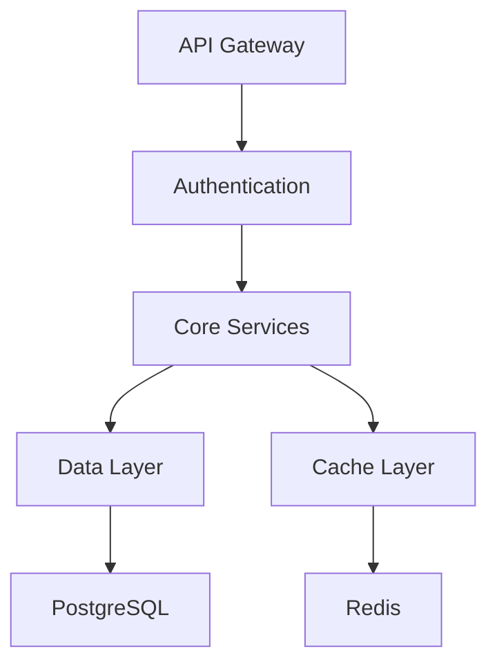
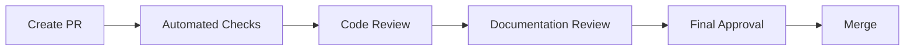

# GameVerse API Development Guide

A comprehensive guide for developers looking to contribute to the GameVerse API project.

## Table of Contents
- [Project Overview](#project-overview)
- [Technical Architecture](#technical-architecture)
- [Development Setup](#development-setup)
- [Coding Standards](#coding-standards)
- [Documentation Guidelines](#documentation-guidelines)
- [Testing Strategy](#testing-strategy)
- [Module Development](#module-development)
- [API Design Guidelines](#api-design-guidelines)

## Project Overview

### Core Concepts
GameVerse API is a modular, scalable platform for gaming content management and distribution. The project follows these key principles:

- **Modularity**: Each feature is a separate module
- **API First**: REST and GraphQL APIs are first-class citizens
- **Documentation Driven**: Comprehensive documentation is mandatory
- **Test Coverage**: Minimum 80% test coverage required
- **Performance**: Response time under 200ms for 95% of requests

### Project Structure
```
GameVerseAPI/
├── core/                  # Core framework modules
│   ├── common/           # Shared utilities
│   ├── security/         # Authentication & authorization
│   └── cache/            # Caching implementation
├── modules/              # Feature modules
│   ├── games/           # Games module
│   ├── users/           # User management
│   └── community/       # Community features
├── docs/                # Documentation
└── infrastructure/      # Infrastructure configuration
```

## Technical Architecture

### Technology Stack
- Java 21
- Spring Boot 3.3.5
- PostgreSQL 15+
- Redis 7.2
- GraphQL
- OpenAPI 3.0

### Key Components


## Development Setup

### Prerequisites
```bash
# Required versions
java --version  # 21 or higher
mvn --version   # 3.8.x or higher
docker --version # 20.10.x or higher
```

### Local Development Environment
```bash
# Clone repository
git clone https://github.com/lgzarturo/GameVerseAPI.git
cd GameVerseAPI

# Install dependencies
mvn clean install

# Start infrastructure
docker-compose up -d

# Run application
mvn spring-boot:run -Dspring.profiles.active=dev
```

### IDE Configuration
- **IntelliJ IDEA Settings**
```xml
<!-- .idea/codeStyles/Project.xml -->
<component name="ProjectCodeStyleConfiguration">
  <code_scheme name="Project" version="173">
    <JavaCodeStyleSettings>
      <option name="CLASS_COUNT_TO_USE_IMPORT_ON_DEMAND" value="999" />
      <option name="NAMES_COUNT_TO_USE_IMPORT_ON_DEMAND" value="999" />
      <option name="PACKAGES_TO_USE_IMPORT_ON_DEMAND">
        <value />
      </option>
    </JavaCodeStyleSettings>
  </code_scheme>
</component>
```

## Coding Standards

### Java Code Style
```java
// Example of proper code style
@RestController
@RequestMapping("/api/v1/games")
@Tag(name = "Games", description = "Games management endpoints")
public class GameController {
    private final GameService gameService;

    @Operation(summary = "Get game by ID")
    @GetMapping("/{id}")
    public ResponseEntity<GameDTO> getGame(@PathVariable Long id) {
        return gameService.findById(id)
            .map(ResponseEntity::ok)
            .orElseThrow(() -> new GameNotFoundException(id));
    }
}
```

### Best Practices
1. **Clean Code Principles**
  - Single Responsibility Principle
  - DRY (Don't Repeat Yourself)
  - KISS (Keep It Simple, Stupid)
  - Meaningful naming

2. **Error Handling**
```java
// Example of proper error handling
@ExceptionHandler(GameNotFoundException.class)
public ResponseEntity<ErrorResponse> handleGameNotFound(GameNotFoundException ex) {
    ErrorResponse error = ErrorResponse.builder()
        .status(HttpStatus.NOT_FOUND.value())
        .message(ex.getMessage())
        .timestamp(LocalDateTime.now())
        .build();
    return new ResponseEntity<>(error, HttpStatus.NOT_FOUND);
}
```

## Documentation Guidelines

### API Documentation
1. **OpenAPI/Swagger**
```java
@Operation(
    summary = "Create new game",
    description = "Creates a new game entry in the system"
)
@ApiResponses({
    @ApiResponse(
        responseCode = "201",
        description = "Game created successfully"
    ),
    @ApiResponse(
        responseCode = "400",
        description = "Invalid input data"
    )
})
public ResponseEntity<GameDTO> createGame(@Valid @RequestBody GameCreateDTO game) {
    // Implementation
}
```

2. **GraphQL Schema**
```graphql
type Game {
  id: ID!
  title: String!
  description: String
  releaseDate: Date
  publisher: Publisher!
  genre: [Genre!]!
}

input GameInput {
  title: String!
  description: String
  releaseDate: Date
  publisherId: ID!
  genreIds: [ID!]!
}
```

### Code Documentation
```java
/**
 * Processes a game update request.
 *
 * @param id The ID of the game to update
 * @param updateDTO The update data transfer object
 * @return The updated game DTO
 * @throws GameNotFoundException if the game doesn't exist
 * @throws ValidationException if the update data is invalid
 */
public GameDTO updateGame(Long id, GameUpdateDTO updateDTO) {
    // Implementation
}
```

## Testing Strategy

### Test Categories
1. **Unit Tests**
```java
@Test
void shouldCreateGame_WhenValidInput() {
    // Given
    GameCreateDTO createDTO = new GameCreateDTO("Test Game", "Description");
    
    // When
    GameDTO result = gameService.createGame(createDTO);
    
    // Then
    assertNotNull(result);
    assertEquals(createDTO.getTitle(), result.getTitle());
}
```

2. **Integration Tests**
```java
@SpringBootTest
@AutoConfigureMockMvc
class GameControllerIntegrationTest {
    
    @Autowired
    private MockMvc mockMvc;
    
    @Test
    void shouldReturnGame_WhenExists() throws Exception {
        mockMvc.perform(get("/api/v1/games/{id}", 1))
            .andExpect(status().isOk())
            .andExpect(jsonPath("$.title").exists());
    }
}
```

## Module Development

### Creating New Modules
1. **Module Structure**
```
modules/new-module/
├── src/
│   ├── main/
│   │   ├── java/
│   │   └── resources/
│   └── test/
├── pom.xml
└── README.md
```

2. **Module Configuration**
```java
@Configuration
@ComponentScan("com.gameverse.newmodule")
public class NewModuleConfig {
    // Module configuration
}
```

### Integration Guidelines
1. **Event Publishing**
```java
@Service
public class GameService {
    private final ApplicationEventPublisher eventPublisher;
    
    public void updateGame(GameUpdateDTO dto) {
        // Update game
        eventPublisher.publishEvent(new GameUpdatedEvent(game));
    }
}
```

2. **Event Handling**
```java
@Component
public class GameEventHandler {
    @EventListener
    public void handleGameUpdated(GameUpdatedEvent event) {
        // Handle game update event
    }
}
```

## API Design Guidelines

### REST API
1. **URL Structure**
```
/api/v1/games              # Collection endpoint
/api/v1/games/{id}         # Single resource
/api/v1/games/{id}/reviews # Sub-resource
```

2. **Response Format**
```json
{
  "data": {
    "id": "123",
    "title": "Game Title",
    "created": "2024-01-01T12:00:00Z"
  },
  "meta": {
    "version": "1.0",
    "timestamp": "2024-01-01T12:00:00Z"
  }
}
```

### GraphQL API
1. **Query Structure**
```graphql
query GetGame {
  game(id: "123") {
    title
    description
    publisher {
      name
      country
    }
  }
}
```

2. **Mutation Structure**
```graphql
mutation UpdateGame {
  updateGame(id: "123", input: {
    title: "New Title"
    description: "New description"
  }) {
    id
    title
    description
  }
}
```

## Contributing Changes

### Feature Development Process
1. Create feature branch
2. Implement changes
3. Add tests
4. Update documentation
5. Create pull request
6. Address review comments
7. Merge to develop

### Documentation Updates
1. **Code Documentation**
  - Update JavaDoc comments
  - Update API documentation
  - Update README files

2. **Technical Documentation**
  - Update development guide
  - Update architecture diagrams
  - Update deployment guide

### Review Process


---

For additional questions or support, please:
- Create an issue on GitHub
- Contact me via email: lgzarturo@gmail.com

